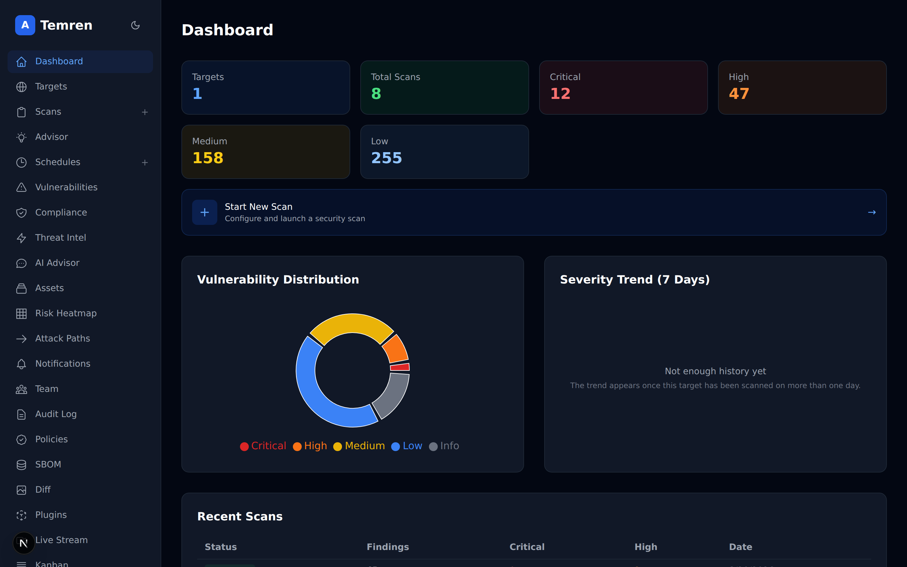
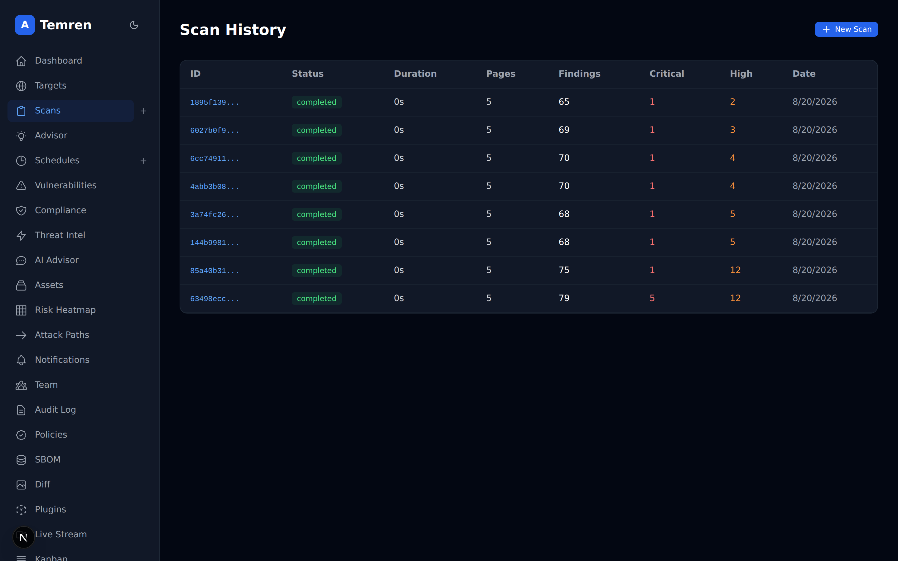
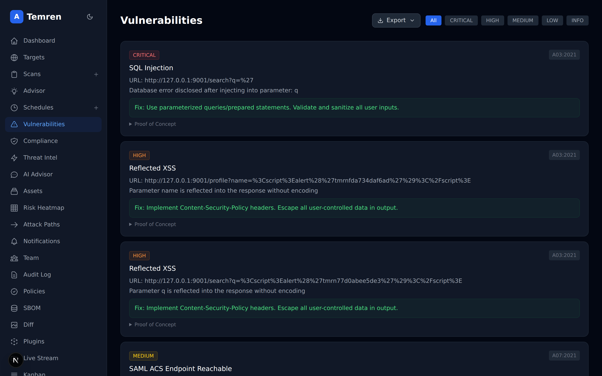
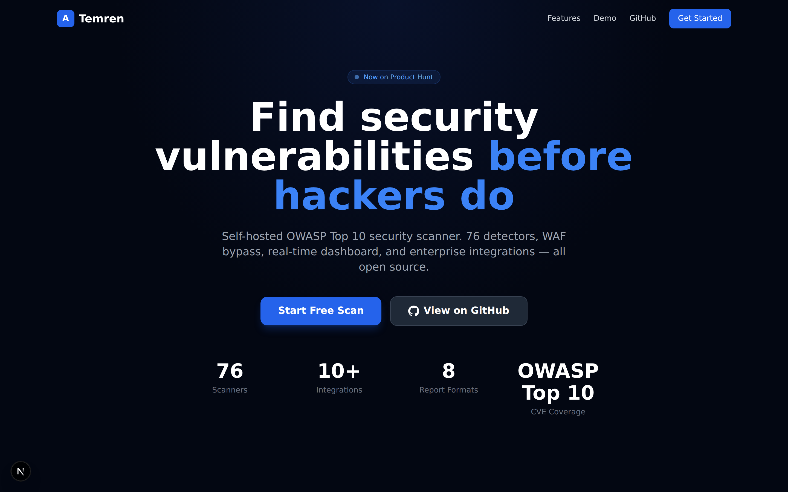
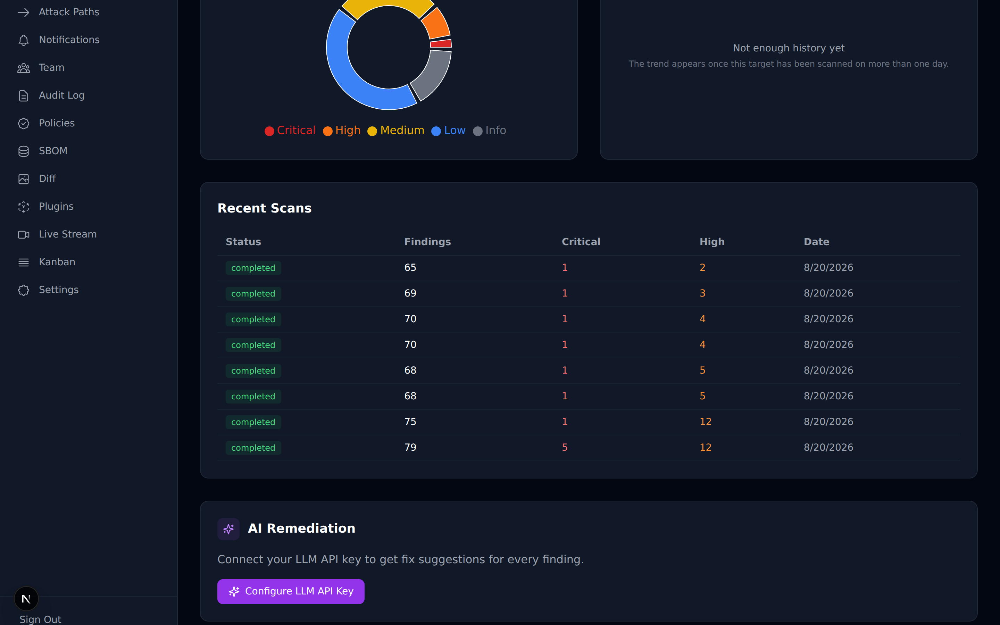

<p align="center">
  
</p>

<h1 align="center">TemrenSec</h1>

<p align="center">
  <strong>Open-Source OWASP Top 10 Security Scanner</strong>
</p>

<p align="center">
  <a href="https://go.dev/"></a>
  <a href="https://nextjs.org/"></a>
  <a href="LICENSE"></a>
  <a href="https://owasp.org/Top10/"></a>
</p>

<p align="center">
  <a href="https://www.producthunt.com/posts/temren" target="_blank">
    
  </a>
</p>

---

## What is Temren?

**Temren** is an open-source, self-hosted security vulnerability scanner that detects **OWASP Top 10** vulnerabilities in your web applications. Unlike expensive commercial tools, Temren gives you full control with a modern dashboard, real-time monitoring, and enterprise-grade features — all for free.

### Why Temren?

- **Free & Open Source** - No per-scan pricing, no API limits
- **76 Scanners** - SQL Injection, XSS, SSRF, IDOR, and more
- **WAF Bypass** - Evades Cloudflare, Akamai, Imperva, AWS WAF
- **Real-time Dashboard** - Watch scans live via WebSocket
- **Integrations** - Jira, GitHub, Slack, Discord, Email alerts
- **Scheduled Scans** - Automated recurring security checks
- **Self-hosted** - Your data stays on your infrastructure

---

## Demo

<p align="center">
  <a href="https://github.com/nickzsche/TemrenSec">
    
  </a>
</p>

<p align="center">
  <a href="https://github.com/nickzsche/TemrenSec">
    
    
  </a>
</p>

---

## Features

### Vulnerability Detection

| Scanner | Description | Severity |
|---------|-------------|----------|
| SQL Injection | Error-based & time-based, both compared against a baseline | Critical |
| XSS | Reflected, verified with a per-request marker | High |
| Command Injection | OS command execution | Critical |
| SSRF | Server-Side Request Forgery | High |
| IDOR | Insecure Direct Object Reference | High |
| Path Traversal | Directory traversal attacks | High |
| XXE | XML External Entity attacks | Critical |
| Auth Failures | Default credentials, brute force | High |
| WAF Bypass | Cloudflare, Akamai, Imperva, AWS WAF | High |

### Dashboard & Monitoring

- **Real-time Scan Progress** - WebSocket-powered live updates
- **Severity Analytics** - Interactive charts (Pie, Bar, Timeline)
- **Vulnerability Timeline** - Track security posture over time
- **CVSS Scoring** - Automatic severity calculation
- **Security Score** - Overall health rating per target

### Integrations

| Platform | Feature | Status |
|----------|---------|--------|
| Jira | Auto-create tickets on findings | Ready |
| GitHub | Auto-create issues on findings | Ready |
| Slack | Instant notifications | Ready |
| Discord | Instant notifications | Ready |
| Email | HTML reports & alerts | Ready |
| Webhooks | Custom endpoint notifications | Ready |

### Enterprise Features

- **Scheduled Scans** - Cron-based automation (hourly, daily, weekly, monthly)
- **Plan-based Rate Limiting** - Free (120 req/min), Pro (600 req/min), Team (2000 req/min).
  Separate from scan quotas, which are Free 1 target / 5 scans, Pro 5 / 50, Team 20 / 200.
- **2FA Authentication** - TOTP support
- **Report Export** - SARIF, CycloneDX, JUnit, CSV, Markdown, JSONL, Jira, HTML, PDF
- **Prometheus Metrics** - Full observability
- **Kubernetes Ready** - Helm chart included
- **CI/CD Integration** - GitHub Actions ready

---

## Quick Start

### Docker Compose

```bash
git clone https://github.com/nickzsche/TemrenSec.git
cd TemrenSec

make setup          # generates .env with a strong JWT secret and DB password
docker compose up -d
```

`make setup` is required: compose refuses to start without `JWT_SECRET` and
`POSTGRES_PASSWORD`, and the API rejects a weak secret in production. The API
applies database migrations on startup, so there is no separate migrate step.

Then visit `http://localhost:8080/health` to confirm the API is up, and run the
dashboard with `cd frontend && npm install && npm run dev`.

`make up` runs both steps, and `make logs` tails the API and worker.

**Scan targets that resolve to private, loopback or link-local addresses are
refused by default** — otherwise anyone with an account could aim a shared
install at your internal network. To scan internal hosts, set
`ALLOW_PRIVATE_TARGETS=true` in `.env`.

### CLI

```bash
# Build CLI binary
go build -o temren ./cmd/temren

# Scan a target
./temren scan --target https://example.com --format json

# Full scan with WAF bypass
./temren scan --target https://example.com --waf-bypass --depth 3
```

### API

```bash
# Register
curl -X POST http://localhost:8080/api/v1/auth/register \
  -H "Content-Type: application/json" \
  -d '{"email":"user@example.com","password":"secret","full_name":"User"}'

# Create target & scan
curl -X POST http://localhost:8080/api/v1/targets \
  -H "Authorization: Bearer <token>" \
  -H "Content-Type: application/json" \
  -d '{"name":"My App","url":"https://example.com"}'

curl -X POST http://localhost:8080/api/v1/targets/{id}/scans \
  -H "Authorization: Bearer <token>"
```

---

## Architecture

```
TemrenSec/
├── CLI         # Single binary scanner
├── API         # REST API server (Go + Fiber)
├── Worker      # Background job processor (Asynq + Redis)
├── Frontend    # Next.js dashboard
└── Scanner     # 76 vulnerability detectors
```

**Stack:** Go 1.21+ | Next.js 15 | PostgreSQL | Redis | Docker | Kubernetes

---

## Tech Stack

| Layer | Technology |
|-------|-----------|
| Backend | Go 1.21, Fiber, GORM |
| Frontend | Next.js 15, React 19, Tailwind CSS, Recharts |
| Queue | Asynq (Redis-based) |
| Database | PostgreSQL 15 |
| Cache | Redis 7 |
| Auth | JWT + TOTP 2FA |
| Metrics | Prometheus |
| Deployment | Docker, Kubernetes, Helm |

---

## Screenshots

<p align="center">
  
</p>

<p align="center">
  
</p>

---

## Roadmap

- [x] OWASP Top 10 **2021** coverage (A01–A10) — findings are categorised against
      the 2021 list, which is what the mapping in `internal/queue` implements.
- [ ] OWASP Top 10 2025 mapping
- [x] Real-time WebSocket updates with optional Redis pub/sub bridge for multi-replica HA (`TEMREN_WS_REDIS`)
- [x] WAF Bypass techniques (payload mutation + Tor identity rotation on 3× consecutive 429s)
- [x] Jira/GitHub/GitLab integration
- [x] Scheduled scans
- [x] PDF/CSV/HTML/SARIF/CycloneDX 1.6/JUnit/Markdown/JIRA/JSONL export — Turkish/Unicode-safe PDF via embedded DejaVu Sans
- [x] CycloneDX 1.6 ML-BOM (`temren mlbom` / `GET /api/v1/mlbom`) — inventory of every AI provider/model the scanner can call
- [x] Custom scanner plugins (Lua via gopher-lua) with sandbox: dangerous globals stripped, 64 MB memory cap, 30 s ctx-deadline, no `io/os/debug/require`
- [x] Per-host adaptive rate limiting (`httpengine.Config.PerHostRate` — global ceiling + per-host token bucket)
- [x] Idempotent scan enqueue (`asynq.Unique` — same scan_id can't run twice within 6 h)
- [x] DefectDojo two-way sync (push via `ImportFindings`, pull triage state via `PullFindings`)
- [x] Scanner benchmark corpus (`benchmarks/accuracy/` — Juice Shop ground truth + precision/recall runner)
- [x] Pluggable egress (`EgressProvider`: direct, rotating proxy list, Tor)
- [ ] Residential proxy provider integrations (Smartproxy / Bright Data)
- [ ] API key management
- [ ] SAML/SSO support
- [ ] Mobile app (React Native)

### Package layout notes

Two namespaces still ship side-by-side; the legacy ones are **deprecated** and
will be removed in **v2.0**:

| Use this | Don't use this | Why |
|---|---|---|
| `pkg/scanner` | ~~`pkg/scanners/active`, `pkg/scanners/passive`~~ | Unified 80+ scanner registry, CVSS 4.0, single `Finding` type |
| `pkg/notify` | ~~`pkg/integration/notify`~~ | 13 channels behind one `Notifier` interface |

### Audit log semantics

The hash-chain audit log (`pkg/auditlog`) is **tamper-evident**, not
tamper-preventing. An attacker with database write access can rewrite the chain
end-to-end — but `temren audit-verify` will then fail at the first checkpoint
exported off-system (e.g. shipped to S3 Object Lock, an SIEM, or a WORM bucket).
For real prevention, pair Temren with append-only storage:
`REVOKE DELETE, UPDATE ON audit_events FROM api_user` plus immutable log shipping.

---

## Contributing

We welcome contributions! See our [Contributing Guide](CONTRIBUTING.md) for details.

```bash
# Quick dev setup
git clone https://github.com/nickzsche/TemrenSec.git
cd temren
go mod download
npm install --prefix frontend

# Run tests
go test ./...

# Start dev environment
docker-compose -f docker-compose.dev.yml up
```

---

## Support

- **Issues**: [GitHub Issues](https://github.com/nickzsche/TemrenSec/issues)
- **Discussions**: [GitHub Discussions](https://github.com/nickzsche/TemrenSec/discussions)
- **Twitter**: [@nickzsche](https://twitter.com/nickzsche)

---

## License

GNU General Public License v3.0 - see [LICENSE](LICENSE) for details.

---

<p align="center">
  <strong>Built with ❤️ by <a href="https://github.com/nickzsche">nickzsche</a></strong>
  <br>
  <sub>Part of <a href="https://zerosixlab.com">ZerosixLab</a> security tools</sub>
</p>
